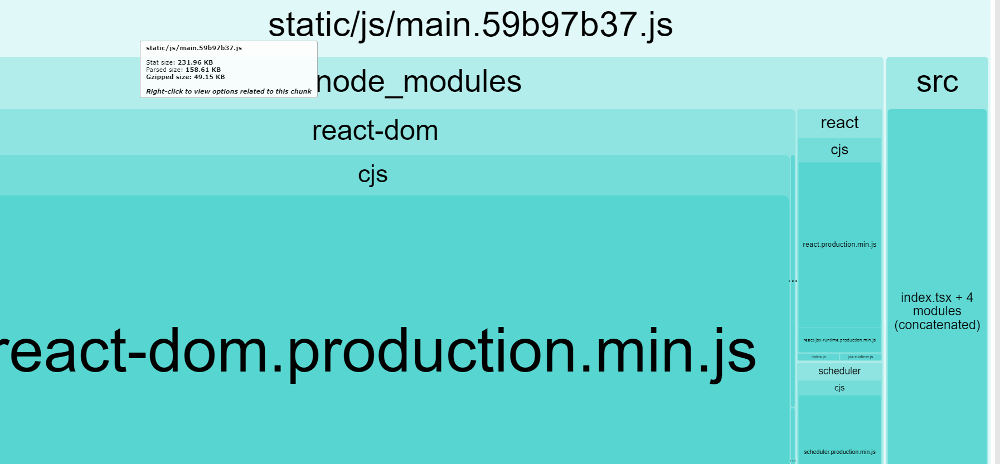
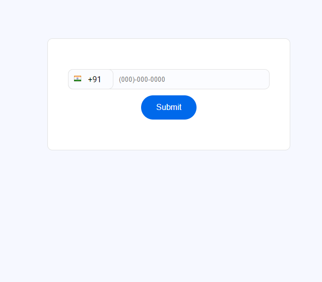
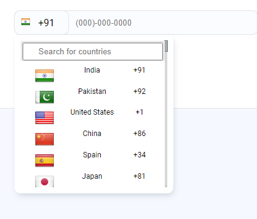

# Here is the basic description of the project and list of requirements met

## Available Scripts

In the project directory, you can run:

### `npm start` : to start the project

Runs the app in the development mode.\
Open [http://localhost:3000](http://localhost:3000) to view it in the browser.

The page will reload if you make edits.\
You will also see any lint errors in the console.
### `npm run analyze` :builds the project folder to see the gzipped size

The gziped version is well below the size limit asked 

### Site live demo:
Open [https://country-code-selector.netlify.app/](https://country-code-selector.netlify.app/) to view it in the browser.
## Requirements Met:

* Mobile first UI
* TypeScript + ReactJS used 
* Phone number input field
    * placeholder conforms to this format (000) 000-0000.
    * The placeholder updates based on the selected country's phone number length.
* A submit button
* The new country selector component..
    * Displays the currently selected country by rendering the country flag and the country code
    * Has a drop-down menu that is opened via on click /tap of the country flag selector
    * The drop-down menu contains two sections, a search field and a country list.
    * The country list displays the country's, flag, name, and calling code
    * The search field filters the country list by country name
    * Selecting a country from the country list...
        * Updates the selected country on the flag selector
        * Updates the phone length validation on the phone number field
        * Updates the phone number fields placeholder value
    * Each country has a specific phone number length the phone number field's mask/         placeholder and validation should conform to this.
* The fully built gzip'd project should be under 806kb.

## External Apis used:
I have used an external api to render flag images according to the country code: ['https://flagsapi.com/${countryCode}/shiny/32.png'](https://flagsapi.com/${countryCode}/shiny/32.png)
